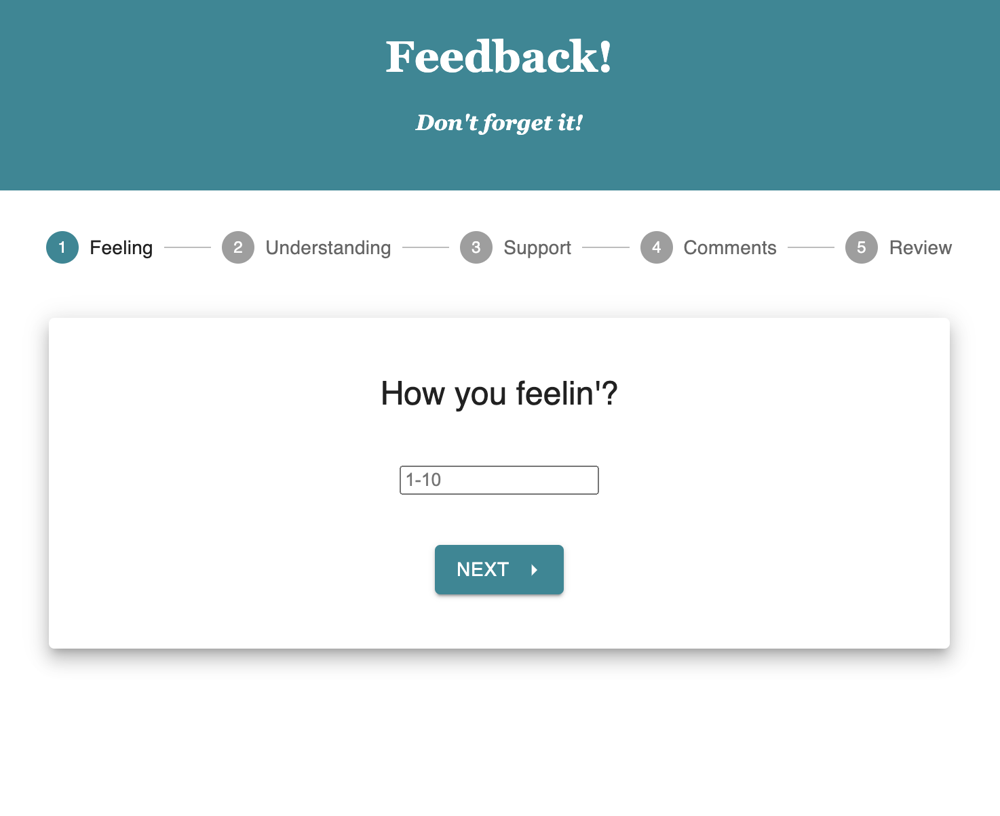
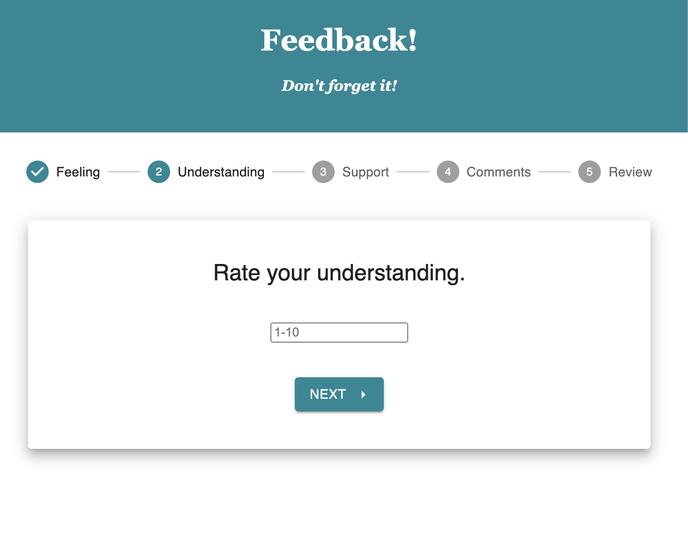
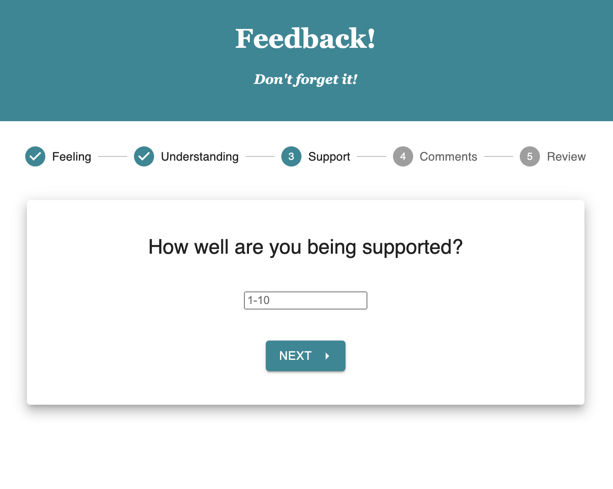
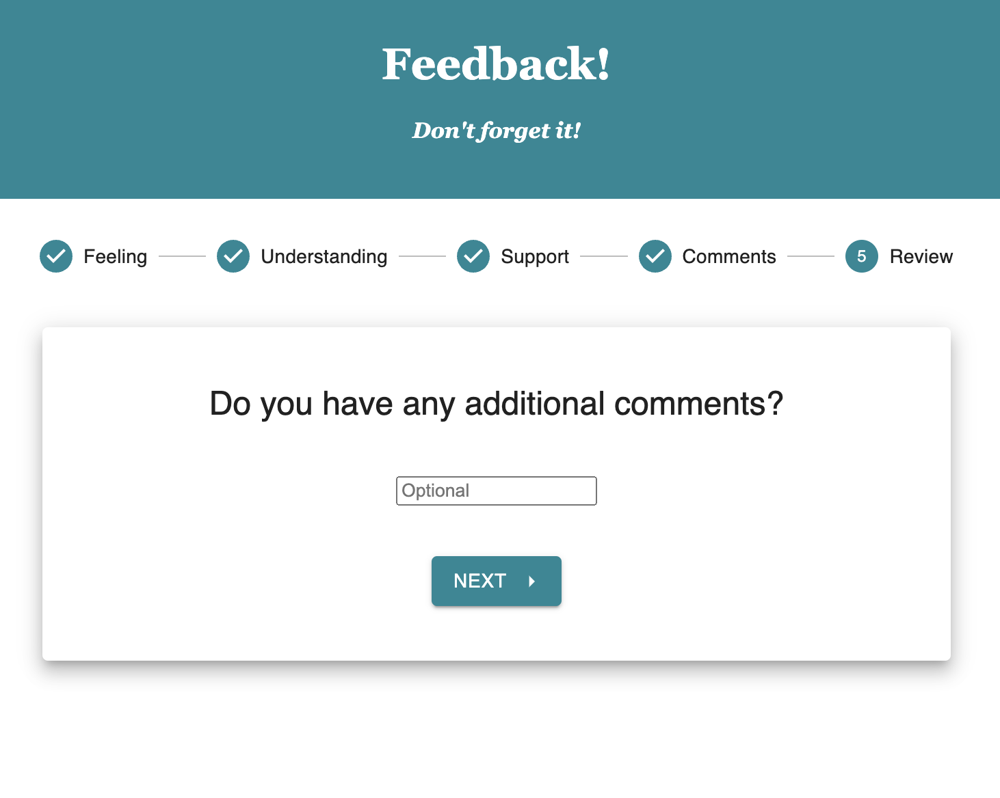
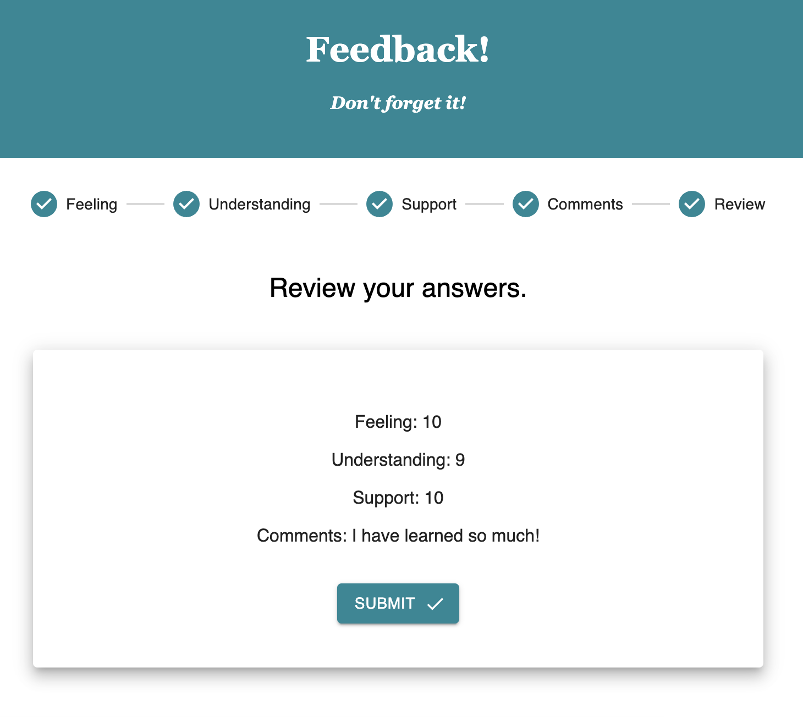
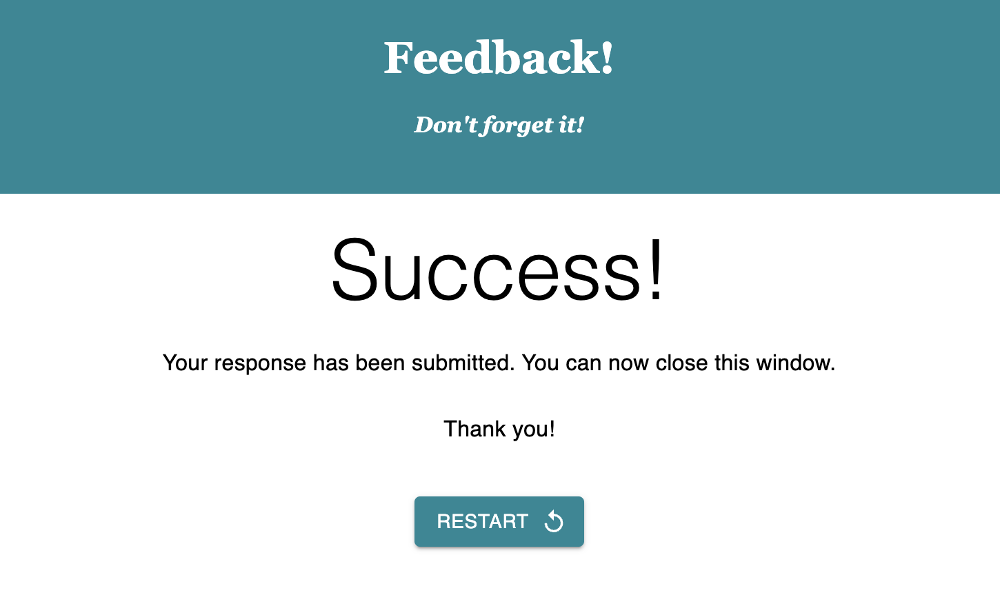

# PROJECT NAME

Redux Feedback Loop

## Description

This web application was created to collect user input and store it on a database. They are asked to rate their feelings and understanding about a topic, if they feel supported, and provide additional (optional) comments. At the end of the survey, users can review their answers and hit submit. After submitting, users are shown a success page and can close the window or restart and take the survey again. 

## Preview

<!-- Add screenshots of each component -->

## Duration

Multiple days of work over a 2 week period.

### Prerequisites

- Node.js
- Nodemon
- React
- Redux
- MUI
- Postico
- Postgres

## Installation

1. Open the built-in terminal in your editor of choice. I use Visual Studio Code.
2. Run `npm install nodemon --global`
2. Run `npm install`
2. Run `npm install redux@4 react-redux@7 redux-logger@3` 
2. Run `npm install @mui/material @emotion/react @emotion/styled`
2. Open a new tab of the terminal and enter `npm run server`
3. In a different tab of the terminal, enter `npm run client`
4. A browser window should open automatically.

## Usage

1. Enter a rating between 1-10 for how you are feeling. Click the next button to proceed to the next step.
2. Continue through the survey. Enter a rating for how well you are understanding, how supported you feel, and any additional comments.
3. Review your answers and click submit.
4. Close the window, or restart the survey.
5. That's it! 

## Built With
React, Redux, MUI, Node.js, Axios, Nodemon, Express, Postgres, Postico

## Acknowledgement
Thanks to [Prime Digital Academy](www.primeacademy.io) for teaching me the things I need to know. 🙌🏽

## Support
If you have any suggestions or issues, please email me at leighh.stephenson@gmail.com

Thanks for viewing!